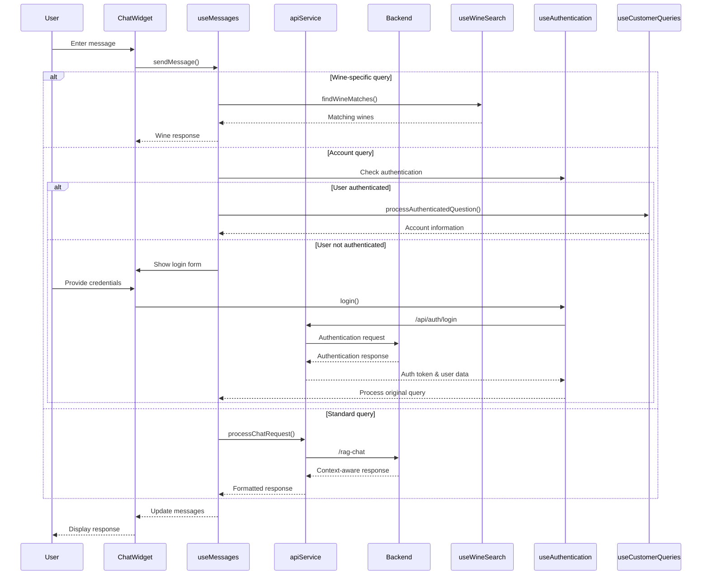
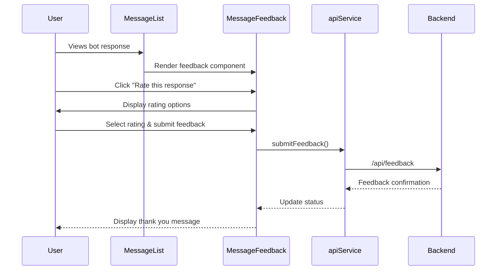
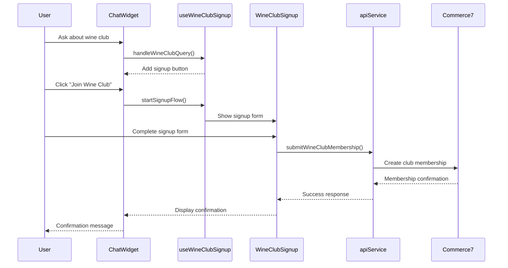

# Milea Estate Vineyard Chatbot: Frontend Architecture Overview

## Introduction

This document provides a comprehensive analysis of the Milea Estate Vineyard Chatbot frontend architecture, highlighting how it interfaces with the backend systems and dashboard components. The architecture follows a modular approach with clear separation of concerns, making it maintainable and extensible.

## System Architecture Overview

The Milea Estate Vineyard Chatbot is built as a React application that connects to a backend RAG (Retrieval Augmented Generation) system. The application consists of three main components:

1. **Chat Interface**: The primary user-facing component that allows customers to interact with the chatbot.
2. **Dashboard**: An administrative interface for monitoring feedback, analytics, and system performance.
3. **Backend Integration**: Connections to various services including the RAG system, Commerce7 API, and authentication services.

## Frontend Architecture Diagram

```mermaid
graph TD
    subgraph "Frontend Application"
        A[App] --> B[Chat Widget]
        A --> C[Dashboard]
        
        subgraph "Chat Components"
            B --> D[MessageList]
            B --> E[MessageInput]
            B --> F[LoginForm]
            B --> G[WineCard]
            B --> H[WineClubSignup]
            B --> I[MailingListSignup]
            B --> J[SmsContactCard]
            D --> K[MessageFeedback]
        end
        
        subgraph "Dashboard Components"
            C --> L[FeedbackPage]
            L --> M[FeedbackList]
            L --> N[FeedbackStats]
            L --> O[FeedbackFilters]
            M --> P[FeedbackDetail]
            N --> Q[FeedbackAnalytics]
        end
        
        subgraph "Hooks & State Management"
            R[useMessages]
            S[useAuthentication]
            T[useWineSearch]
            U[useCustomerQueries]
            V[useWineClubSignup]
            W[FeedbackContext]
            X[AuthContext]
        end
        
        B -.-> R
        B -.-> S
        B -.-> T
        B -.-> U
        B -.-> V
        L -.-> W
        C -.-> X
    end
    
    subgraph "Backend Systems"
        Y[RAG Chat Backend]
        Z[Commerce7 API]
        AA[Authentication Service]
        AB[Feedback API]
        AC[SMS Service]
    end
    
    R --> Y
    T --> Z
    S --> AA
    W --> AB
    J --> AC
```



## Directory Structure

The frontend codebase follows a structured organization:

```
milea-chatbot-frontend/
├── public/                      # Static assets
│   ├── index.html                 # Main HTML file
│   ├── favicon.ico                # Site favicon
│   ├── manifest.json              # Web app manifest
│   └── terms.html                 # Terms and conditions
│
├── src/                         # Application source code
│   ├── App.js/App.tsx            # Main application component
│   ├── index.js/index.tsx        # Application entry point
│   ├── components/                # React components
│   │   ├── chat/                  # Chat-specific components
│   │   │   ├── ChatWidget.jsx       # Main chat widget
│   │   │   ├── components/          # Chat sub-components
│   │   │   │   ├── LoginForm.jsx      # Authentication form
│   │   │   │   ├── MessageInput.jsx   # User input component
│   │   │   │   ├── MessageList.jsx    # Message display component
│   │   │   │   ├── WineCard.jsx       # Wine information display
│   │   │   │   ├── MessageFeedback.jsx # Feedback collection component
│   │   │   │   ├── WineClubSignUp.jsx # Wine club membership signup
│   │   │   │   ├── MailingListSignup.jsx # Email list signup
│   │   │   │   ├── MileaMilesReferral.jsx # Referral component
│   │   │   │   └── SmsContactCard.jsx    # SMS contact form
│   │   │   ├── hooks/               # Custom React hooks
│   │   │   │   ├── useAuthentication.js  # Authentication state management
│   │   │   │   ├── useCustomerQueries.js # Customer data handling
│   │   │   │   ├── useMessages.js       # Message state management
│   │   │   │   ├── useWineSearch.js     # Wine search functionality
│   │   │   │   └── useWineClubSignup.js # Wine club signup logic
│   │   │   ├── services/            # API integrations
│   │   │   │   └── apiService.js      # Backend API client
│   │   │   └── utils/               # Utility functions
│   │   │       ├── formatters.js      # Data formatting utilities
│   │   │       ├── stringMatching.js  # String matching algorithms
│   │   │       ├── textUtils.js       # Text processing utilities
│   │   │       ├── wineUtils.js       # Wine-specific utilities
│   │   │       ├── markdownParser.js  # Markdown formatting
│   │   │       └── queryHelpers.js    # Query classification utilities
│   │   └── dashboard/              # Dashboard components
│   │       ├── DashboardLayout.jsx   # Layout wrapper
│   │       ├── Header.jsx            # Dashboard header
│   │       ├── Sidebar.jsx           # Navigation sidebar
│   │       └── MainContent.jsx       # Content container
│   ├── contexts/                   # React context providers
│   │   └── AuthContext.tsx          # Authentication context
│   ├── pages/                      # Page components
│   │   ├── Dashboard.jsx/tsx        # Dashboard page
│   │   └── Login.tsx                # Login page
│   └── utils/                      # Shared utilities
│
├── docs/                         # Documentation
│   ├── RAG_implementation*.md     # RAG system documentation
│   └── milea-chatbot-frontend*.md # Frontend documentation
│
├── package.json                  # Project dependencies
└── tailwind.config.js            # Tailwind CSS configuration
```

## Component Interactions

### Chat System Components

1. **ChatWidget.jsx**
   - Acts as the container for the entire chat interface
   - Manages the display of different UI components based on the current state
   - Orchestrates interactions between sub-components

2. **MessageList.jsx & MessageInput.jsx**
   - Handle the display of chat messages and user input collection
   - Integrated with MessageFeedback for collecting user feedback
   - Support various message formats including markdown content

3. **Custom Hooks**
   - **useMessages.js**: Core hook that manages the chat state and handles interactions with the backend
   - **useWineSearch.js**: Specialized for wine search functionality with fuzzy matching
   - **useAuthentication.js**: Manages user authentication and token handling
   - **useCustomerQueries.js**: Processes customer-specific queries requiring authentication
   - **useWineClubSignup.js**: Handles the wine club signup flow

4. **Utility Functions**
   - Text processing (textUtils.js)
   - Wine-specific utilities (wineUtils.js)
   - String matching for wine names (stringMatching.js)
   - Formatting for responses (formatters.js)
   - Query classification (queryHelpers.js)

### Dashboard Components

1. **DashboardLayout.jsx**
   - Provides the overall structure for the dashboard
   - Includes Header, Sidebar, and MainContent components

2. **Feedback Management**
   - **FeedbackPage.jsx**: Main page for feedback overview
   - **FeedbackList.jsx**: Displays a list of feedback items
   - **FeedbackDetail.jsx**: Shows detailed feedback information
   - **FeedbackStats.jsx**: Displays analytics about collected feedback

3. **State Management**
   - Uses React Context (AuthContext, FeedbackContext) for application-wide state
   - Implements protected routes for authenticated access

## Backend Integration

The frontend integrates with several backend services:

1. **RAG Chat System**
   - Connects to the `/rag-chat` endpoint for context-aware responses
   - Sends user queries and receives AI-generated responses
   - Processes and formats responses for display

2. **Commerce7 Integration**
   - Fetches wine product data for display and search
   - Manages customer account information
   - Handles wine club membership signups

3. **Authentication System**
   - Manages user login/logout process
   - Stores authentication tokens
   - Handles protected routes and authenticated queries

4. **Feedback System**
   - Collects user feedback on bot responses
   - Submits feedback to backend for storage and analysis
   - Retrieves feedback data for dashboard display

5. **SMS Service**
   - Enables users to contact the winery via SMS
   - Manages SMS conversation threads
   - Records conversation history

## Key Features and Workflows

### 1. Chat Interaction Flow



### 2. Feedback Collection Flow



### 3. Wine Club Signup Flow



## Integration Points with Backend RAG System

The frontend integrates with the backend RAG system in several ways:

1. **Chat Query Processing**
   - The frontend sends user queries to the RAG backend via the `/rag-chat` endpoint
   - The backend processes the query, retrieves relevant context, and generates a response
   - The frontend receives and formats the response for display

2. **Context-Aware Responses**
   - The RAG system incorporates document context into responses
   - Sources are tracked for attribution and feedback purposes
   - Response quality is enhanced with domain-specific knowledge

3. **Wine Product Information**
   - Wine data is synchronized from Commerce7 to the RAG system
   - The frontend can search and display wine information retrieved from the backend
   - Wine recommendations are enhanced with contextual understanding

## Technology Stack

- **Frontend Framework**: React 19.0.0
- **Styling**: Tailwind CSS 3.3.0
- **HTTP Client**: Axios 1.8.1
- **State Management**: React Hooks and Context API
- **Routing**: React Router 7.4.0
- **Real-time Communication**: Socket.io (for SMS chat)
- **Visualization**: Recharts (for dashboard analytics)
- **Date Handling**: date-fns
- **Type Safety**: TypeScript (for some components)

## Deployment and Environment Configuration

The application supports multiple deployment environments:

1. **Development**: Local development setup with hot reloading
2. **Test**: Testing environment with mock services
3. **Production**: Optimized build for customer-facing deployment

Environment-specific configurations are managed through `.env` files:

- `.env.development`: Development settings
- `.env.test`: Testing configuration
- `.env.production`: Production settings

## Recommendations for Development

1. **Component Testing**
   - Implement comprehensive tests for custom hooks and components
   - Use React Testing Library for component-level tests
   - Add end-to-end tests for critical user flows

2. **Performance Optimization**
   - Implement code splitting for the dashboard components
   - Optimize bundle size with tree shaking
   - Add caching for frequently accessed data

3. **Internationalization**
   - Add support for multiple languages
   - Implement text extraction and translation workflows
   - Consider regional date and number formatting

4. **Accessibility Improvements**
   - Conduct an accessibility audit
   - Implement ARIA attributes for all interactive components
   - Add keyboard navigation support for all features

5. **Mobile Responsiveness**
   - Continue improving mobile layouts for dashboard components
   - Optimize touch interactions for mobile users
   - Test on various mobile devices and screen sizes

## Conclusion

The Milea Estate Vineyard Chatbot frontend architecture employs a modular design with clear separation of concerns. The use of React hooks and context for state management provides a flexible and maintainable codebase. The integration with the backend RAG system enables context-aware responses that enhance the user experience.

The dashboard components provide valuable insights into user feedback and system performance, allowing for continuous improvement of the chatbot. As development continues, focusing on testing, performance optimization, and accessibility will ensure a robust and user-friendly application.